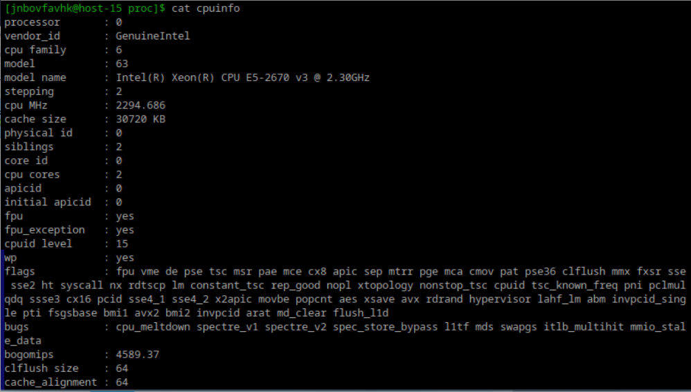
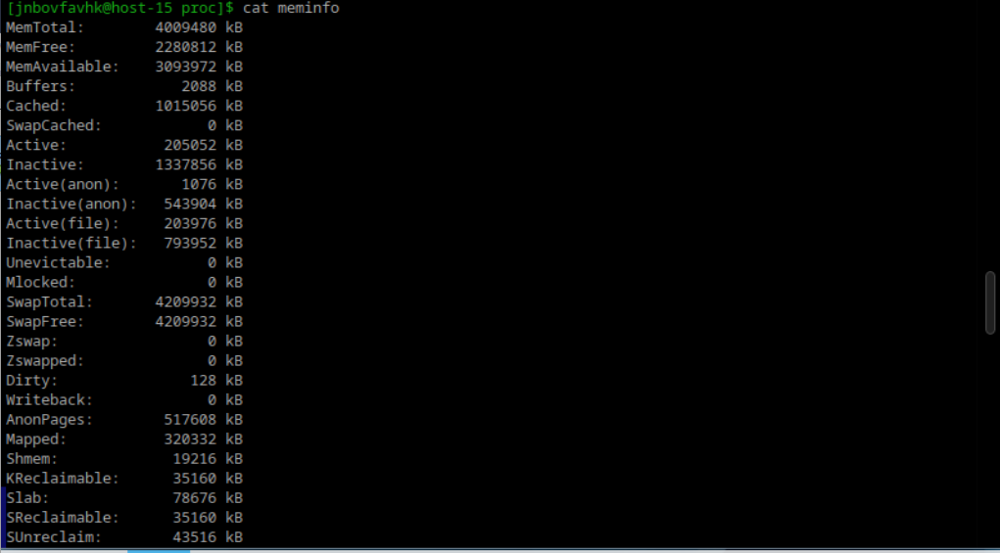

# Илья Белоножко, 1 подгруппа  
## Файловые системы  
**1**
Существуют 4 версии Ext(Ext1, Ext2, Ext3, Ext4), первые две их которых - нежурналируемые. В большинстве дистрибутивов по умолчанию используется Ext4. Также существуют XFS, Btrfs. Первая записывает в журнал только изменения в метаданных(тип файла, размер, адреса ячеек памяти и тд) и привлекательна за счет быстрой работы с большими данными.  
Btrfs выделяется возможностью делать снапшоты и облегченным восстановлением информации.  
OpenZfs - встроенная в ubuntu файловая система, отличается автоматическим восстановлением и поддержкой больших объемов данных.  
  
**2**
Классифицировать можно на журналируемые и нежурналируемые. В первые записывается история действий, во вторые - нет.  
  
**3**
Кроме вышеперечисленных наиболее широкоиспользуемыми являются procfs и sysfs. Первая позволяет выводить все процессы, выполняющиеся в данный момент(команды ps: process status(текущая информация); top: table of processes(динамическая); w: информация о пользователях в системе)  
sysfs позволяет видеть информацию о подключенных устройствах, драйверах, в общем, информацию, определенную внутри ядра  
  
**4**
Создать файловую систему - команда mkfs  
  
**5**
Примонтировать ее куда-нибудь - mount [файловая система] [куда]. Монтирование - подключение какого-либо устройства(и, соответственно, его файловой системы) или файловой системы в папку, то есть обеспечение доступа к чему-либо из папки  
  
**6**
cifs(common internet file system) - файловая система для обеспечения доступа к файлам или папкам удаленных серверов или устройств  
tmpfs(temporary file system) - хранит данные в оперативной памяти. Полезна, если нужно, чтобы данные были удалены при перезагрузке системы.  
  

findmnt или mount - вывести информацию о монтированных файловых системах в разных форматах. Чтобы вывести о конкретной, нужно либо использовать mount | grep [фс] или findmnt -t [фс]  

  **7**
информация и системе находится в каталоге /proc. Оттуда уже можно выводить различную информацию, например:
cat cpuinfo  

cat meminfo  

