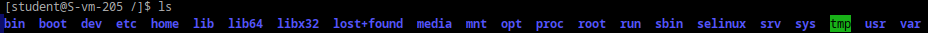

# Илья Белоножко, 1 подгруппа  
## **1** Какая структура каталогов в linux? выведите список файлов в корне системы   
каталоги  
  
bin - исполняемые файлы пользователя(команды)  
sbin - исполняемые файлы системы(в том числе команды, которые может выполнирть только суперпользователь)  
boot - файлы, необходимые для загрузки системы(загрузчик и ядра)  
dev - файлы абстрактных устройств, соответсвующие аппаратным устройствам, также псевдоустройства, вроде random и null
etc - конфигурационные файлы системы, скрипты для запуска и завершения системных программ, монтирования и автозагрузки  
home - домашние папки пользователей
lib - библиотеки, необходимые для работы системных программ  
lib64 - то же самое для 64разрядных систем  
libx32 - 32-разрядные библиотеки для архитектуры x32 ABI  
lost+found - файлы, которые были удалены, когда были использованы каким-либо процессом  
media - каталоги, к которым автоматически монтируются съемные носители(флешки, диски)  
mnt - каталоги, к которым вручную монтируются подключенные устройства  
opt - дополнительные пакеты программного обеспечение  
proc - информация о процессах(папки с названиями, соответствующими pid процессов)  
root - домашняя папка рута  
run - системная информация, написанная с момента загрузки. При каждой перезагрузке все папки удаляются  
srv - данные для сервисов, запускаемых в системе  
sys - информация об устройствах, драйверах и некоторых свойствах ядра  
tmp - файлы, временно использующиеся системой  
usr - исполняемые файлы, библиотеки, компоненты ядра, данные программ, установленных пользователями
var - изменяемые данные, типа кэша, баз данных
## **2** Где хранятся папки пользователей в системе?  
Домашние папки юзеров в /home/[имя юзера]  
## **3** Где домашняя папка суперпользователя?  
Домашняя папка рута - /root  
## **4** Где хранятся основые конфигурационные файлы в системе?  
основные конфигурационные файлы - /etc  
## **5** ЧТо за папки /bin,/sbin,usr/sbin,/usr/sbin  
/bin содержит жизненно важные исполняемые файлы для пользователя, /usr/bin - дополнительные. То же самое с /sbin и /usr/sbin
