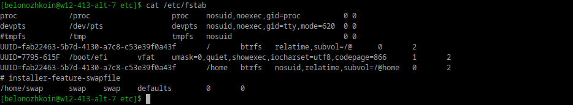
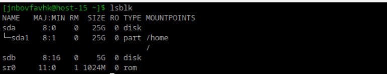

# Илья Белоножко, 1 подгруппа  
## Задание 3. fstab  

### **1** Выведите содержимое fstab. Что хранится в fstab?  
  
fstab хранит в себе строки, каждая из которых содержит информацию о блочном устройстве, точке монтирования(каталог), типе файловой системы, опциях монтирования(чтобы увидеть список опций - команда man mount), информация о том, должна ли файловая система быть выгружена, порядок fsck(если 0 - проверена не будет, 1 - первым делом(обычно для корневой файловой системы), 2 - всё остальное)  

### **2** Добавьте в виртуальную машину ещё один диск  
  

### **3** выведите информацию о блочных устройствах  
`lsblk`  

### **4** С помощью полученной информации создайте на диске таблицу разделов и фаловую систему ext4  
sudo fdisk /dev/sdb - открыть утилиту для создания разделов  
в ней:  
g - новая пустая таблица разделов с GPT(стандарт схем раздела для загрузки диска в UEFI)
n - создать новый раздел  
после номера раздела и сектора начал нужно будет ввести последний сектор. Либо можно указать размер раздела(например, +5GiB)  
p - отобразить таблицу разделов  
w - сохранить изменения  
Дальше, чтобы создать файловую систему на диске, нужно воспользоваться командой:  
`mkfs -t ext4 /dev/sdb`  
Далее можно создавать точки монтирования с помощью mkdir и монтировать с помощью sudo mount. Если нужно, чтобы всё не сбрасывалось при перезапуске, добавить точки в /etc/fstab  
### **5** Примонитруте диск в каталог /mnt  
`mkdir /mnt/newdir`  
`sudo mount /dev/sdb /mnt/newdir`  
### **6** Зайдите в каталог и создайте там файлы  
`cd /mnt/newdir`  
`echo "da" > /mnt/newdir/file1`  
### **7** Отмонтируйте диск и проверье остались ли файлы  
`sudo umount /mnt/newdir`  
Больше файлов нет  
### **8** Сделайте так чтобы диск автоматически подключался при загрузке систем ( добавьте информацию о нём с fstab)  
`sudo blkid` - узнать uuid дисков  
### **9** Проверьте корретность записанных в fstab данных перед перезагрузкой  
`vim /etc/fstab`  
добавить строку "UUID=... /mnt/newdir ext4 defaults 0 0"  
esc  
:qw  
### **10** Перезагрущите систему и убедитесь что диск был подключён к системе 
Ок
