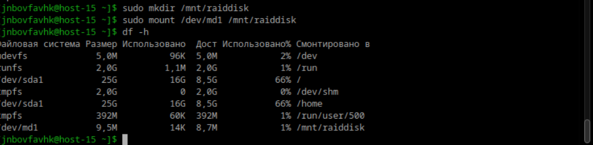
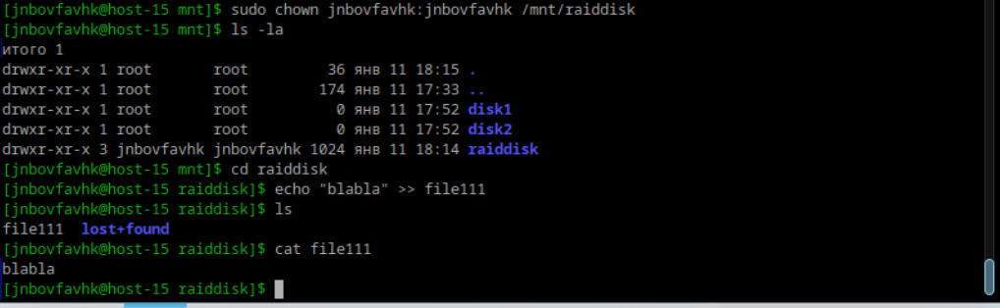

# Илья Белоножко, 1 подгруппа  
## 1 Raid массивы, что такое и какие бывают  
RAID-массив - массив данных, состоящий из несколькоих объединенных массивов данных. Существует несколько способов связывавния массивов между собой:  
RAID 0: Данные разбиваются на блоки и распределяются по всем дискам в массиве. Это повышает производительность, так как несколько дисков могут работать одновременно, но если один диск выйдет из строя, все данные будут потеряны.  
RAID 1: Данные дублируются на каждом диске в массиве. Это обеспечивает высокую надежность, так как если один диск выйдет из строя, данные остаются доступными на другом.
Однако объем доступного пространства равен объему самого маленького диска в массиве.  
RAID 5: Данные и контрольные суммы распределяются по всем дискам. Это обеспечивает хорошую производительность и защиту данных.
Если один диск выйдет из строя, данные могут быть восстановлены с помощью контрольной суммы. Для RAID 5 требуется минимум три диска.  
RAID 6: Похож на RAID 5, но использует двойной паритет, что позволяет выдерживать выход из строя двух дисков одновременно. Паритет - метод обеспечения избыточности данных,
представляет собой дополнительную информацию, вычисляемую на основе данных, хранящихся на других дисках, с помощью операции неравенства. Это обеспечивает дополнительную защиту данных, но требует больше дискового пространства для хранения контрольных сумм.  
RAID 10 (или RAID 1+0): Комбинирует преимущества RAID 0 и RAID 1. Данные сначала дублируются (RAID 1), а затем разбиваются на блоки (RAID 0). Это обеспечивает высокую производительность и надежность, но требует минимум четыре диска.  

## 2 Добавьте в виртуальную машину 2 диска отформатируйте их в ext4  
  
  
  
## 3 Создайте из них raid 0 массив  
  
  

## 4 Проверье всё ли работает  

## 5 Удалите raid0 и создайте raid1  
`sudo umount /dev/md0`  
`sudo mdadm --stop /dev/md0`  
`sudo mdadm --remove /dev/md0`  
Создать md2  
`sudo mdadm --create /dev/md2 --level=1 --raid-devices=2 /dev/sdb1 /dev/sdc1`  
## 6 В чём между ними разница?  
В raid 0 данные разбиваются на блоки и распределяются по всем дискам в массиве. В raid 1 данные дублируются на каждом диске  
## 7 Есть ли файловые системы которые поддерживают raid массивы без стороненго ПО  
Btrfs и Zfs
## 8 Можно ли создать raid массив во время установки системы?  
Можно, для этого во время установки нужно выбрать опцию для ручной настройки разделов
