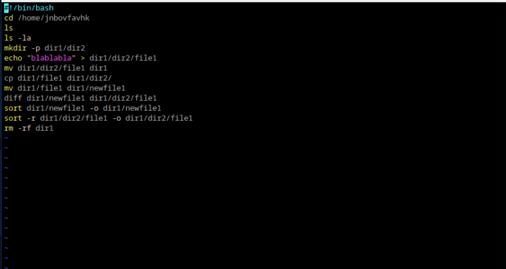
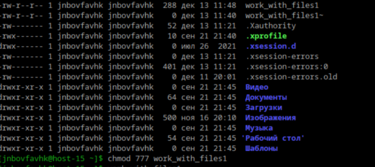
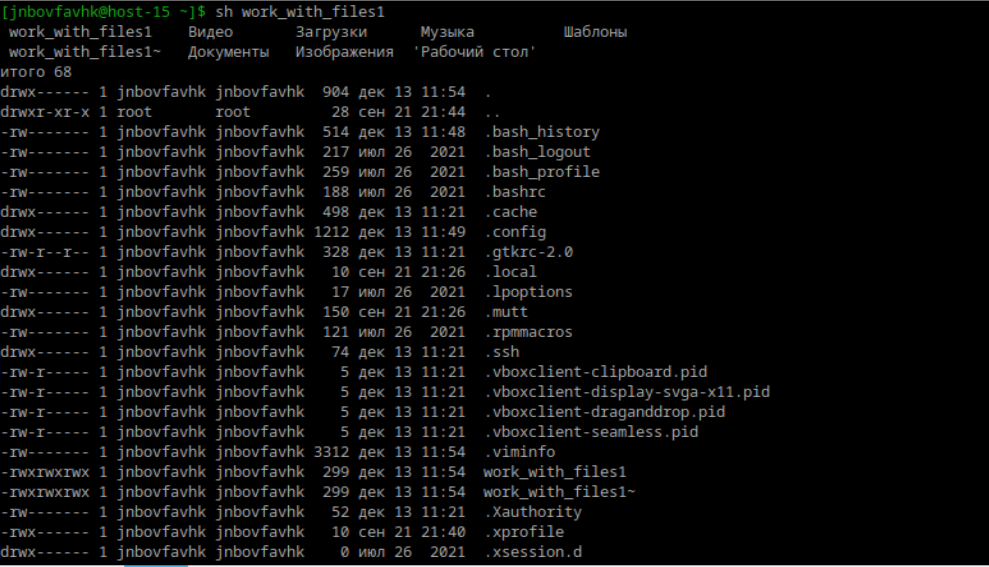
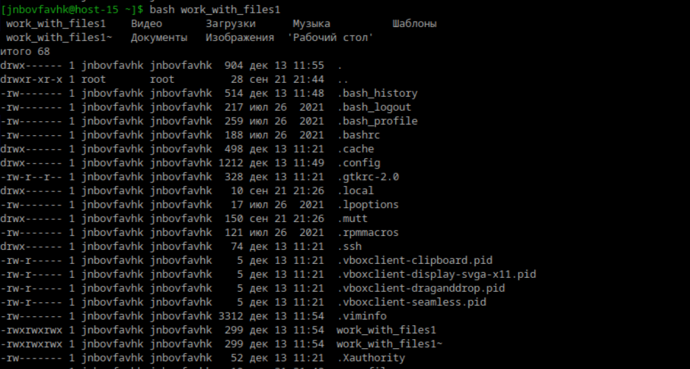

# Илья Белоножко, 1 подгруппа  
**1**  
Шебанг - "#!" в начале файла скрипта. После шебанга должен идти путь к бинарному интерпретатору, который и должен выпоолнить дальнейший код. Например:
#!/bin/zsh - выполнить с использованием оболочки zsh  
#!/usr/bin/python3 - выполнить как код на питон  
**2**  
у двоичных исполняемых файлов в linux расширение elf, у пользовательских скроиптов может не быть расширения. Но если скрипт будет использовать не одно устройство, то расширение гарантирует, что скрипт будет исполнен при помощи правильного интерпретатора  
**3**  
с помощью vim создаем скрипт  
  
меняем права, чтобы можно было выполнить  
  
выполняем с помощью любой командной оболочки  
  

