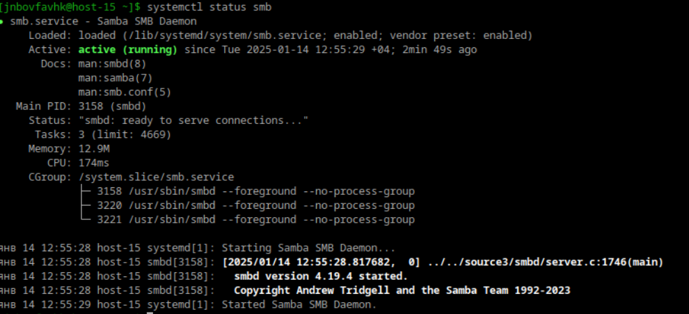
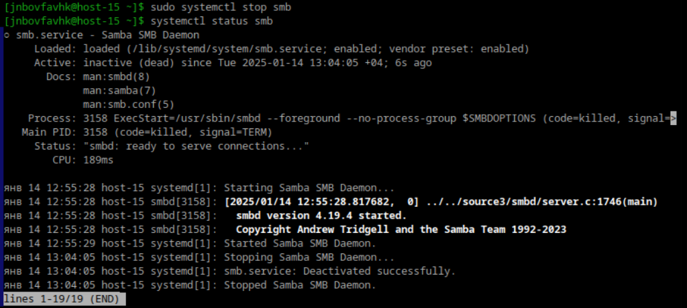
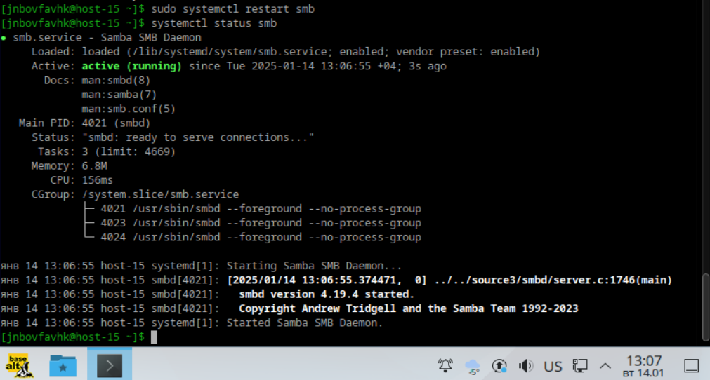
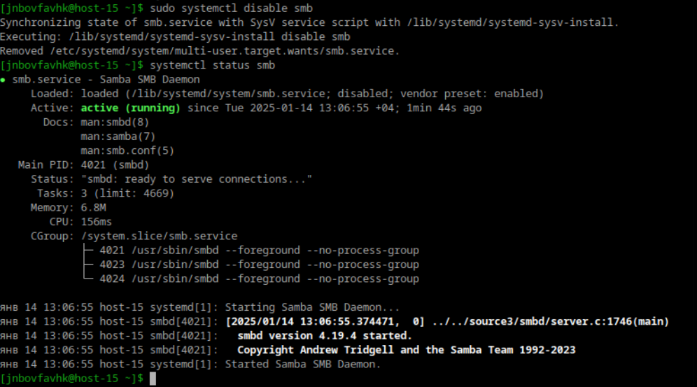
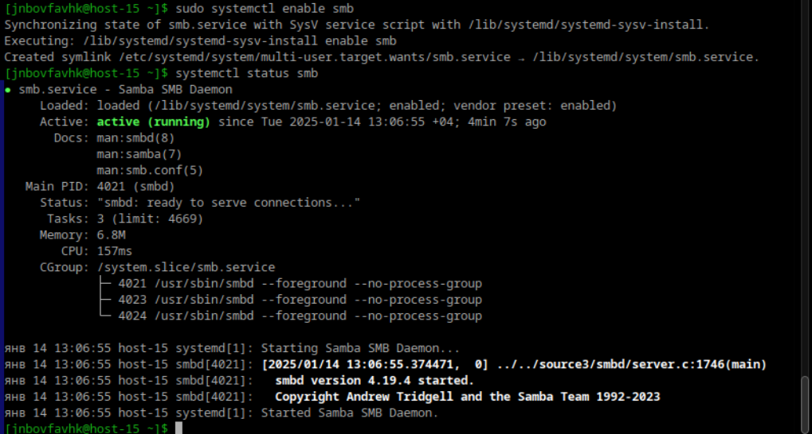

# Илья Белоножко, 1 подгруппа  
## 1. Что такое systemd юнит?  
Systemd - система инициализации и менеджер системных служб. Systemd юнит - конфигурационный файл, использумый systemd для управления службами, монтированием и тд  
## 2. Проверье статус любого systemd юнита, какую информацию выводит эта команда?  
  
## 3. ПОпробуйте оставновить сервис  
  
## 4. Перезапустите его  
  
## 5. УДалите из автозагрузки  
  
## 6. Верните обратно  
  
## 7. Что такое таймеры?  
Это юнит запускает сервис, с которым он связан в определенное время. Можно установить дату, время, периодичность запуска или через какое время после запуска он будет запускаться еще раз.  
