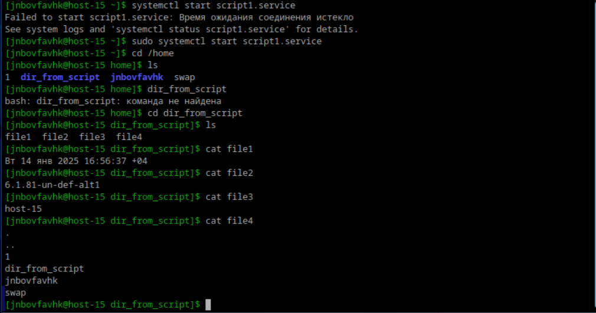
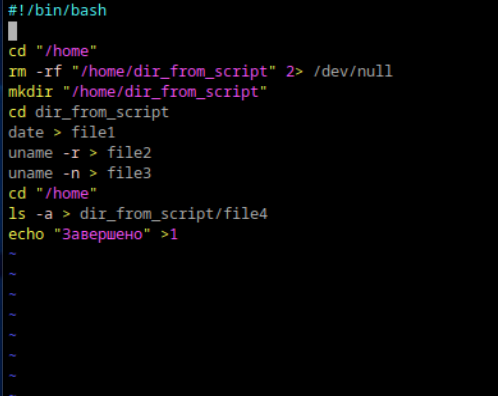
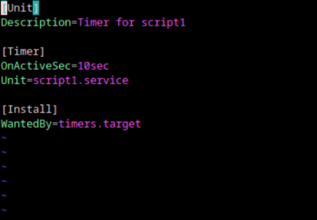
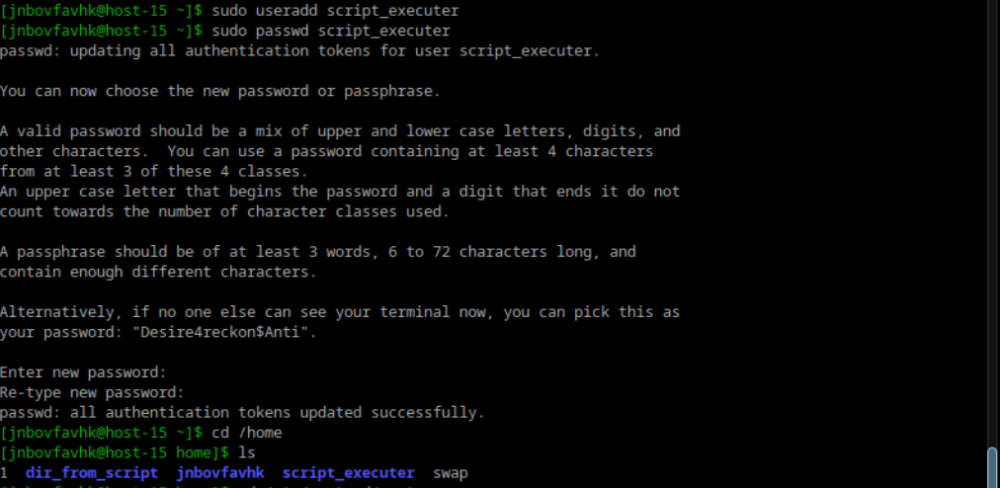
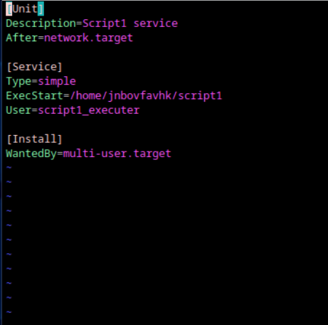

# Илья Белоножко, 1 подгруппа  

## 1. Создайте скрипт который создаёт папку заполняет её файлами ( имена 1-4 ) и записывает в них информацию  
о текущей дате, версии ядра, имени компьютера и списке всех файлов в домашнем каталоге пользователя от которого выполняется скрипт( не забудьте сдлеать проверку на существование файлов и папок)  
## 2. Создайте юнит который будет вызывать этот скрипт при запуске. Проверьте  
  
  
Я смог сделать и юнит, и скрипт, но мой комп может запускать действия в системстл только при помощи sudo. Если я пытаюсь без него, вылезает окно PolicyKit1, которое требует пароль от рута. Но при его вводе показывает ошибку аутентификации.
Таким образом, если я буду внутри скрипта использовать $HOME, мне сообщат, что переменная не задана, а поэтому прогнрамма не запустится. Поэтому задание сделано
немного по-другому(скрипт создает и берет данные из папки /home, а не из домашней запустившего)  
  
## 3. Создайте таймер который будет вызывать выполнение одноимённого systemd юнита каждые 5 минут.  
  
## 4. От какого пользователя вызыаются юниты поумолчанию?  
Если юнит находится в папке пользователя(домашней или другой), то от его имени. Иначе - от рута. Также можно задать пользователя внутри юнита  
## 5. Создайте пользователя от имени которого будет выполняться ваш скрипт.  
  
## 6. Дополните юнит информацией о пользователе от которого должен выплняться скрипт.  
  
## 7. Дополните ваш скрипт так, что бы он независимо от местоположения всегда выполнялся в домашней папке того кто его вызывает.  
Нужно добавить `cd "$HOME"` в начале скрипта
