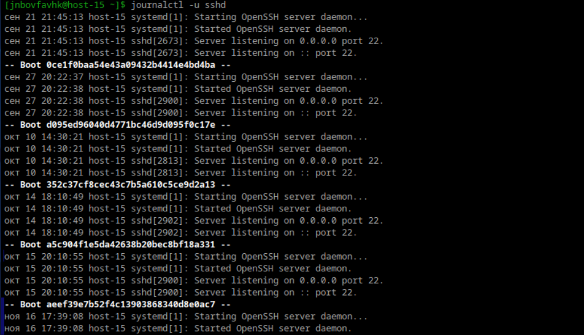
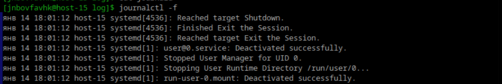
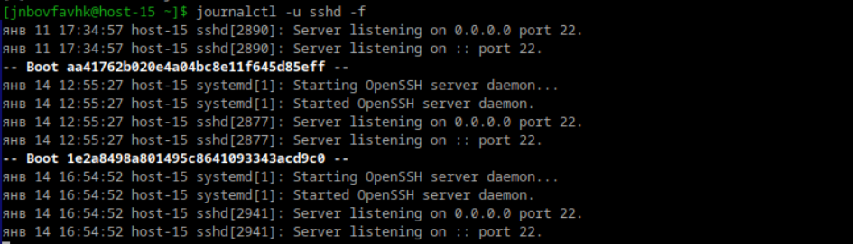
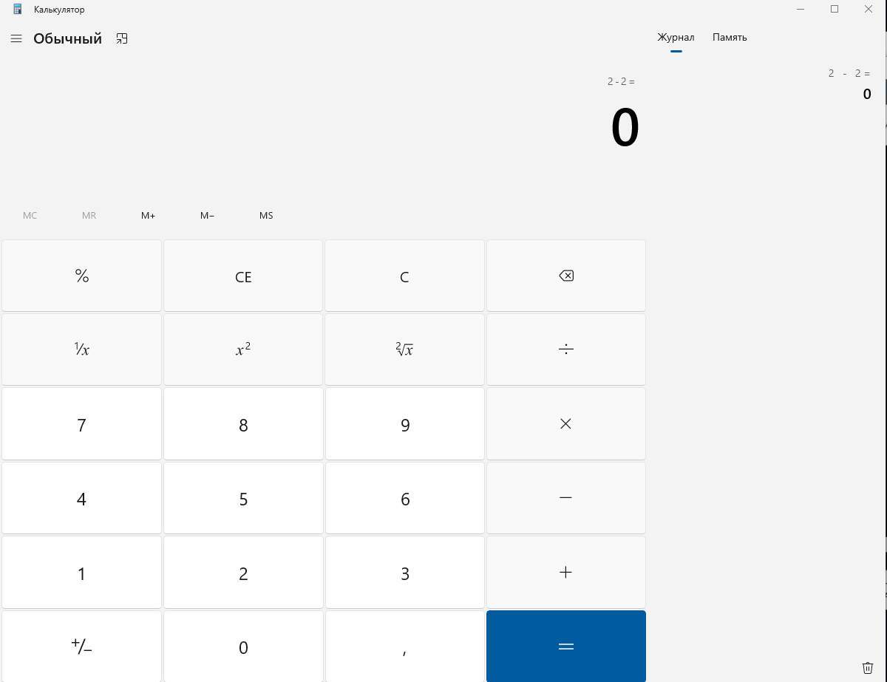

# Илья Белоножко, 1 подгруппа  
## Посмотретите журналы ssh  
  
## Выведите журналы в реальном времени  
  
## Выведите лог в реальном времени для службы sshd  
  
## Можно ли без комады journalctl прочитать логи systemd?  
Да, в каждос дистрибутиве по-разному. В alt linux, например, в /var/log/journal. Но они там в специальном формате, недоступном человеческому глазу  
## Сколько будет 2-2?  

