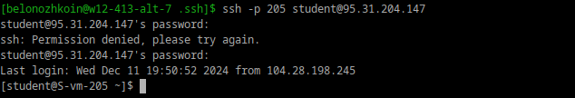
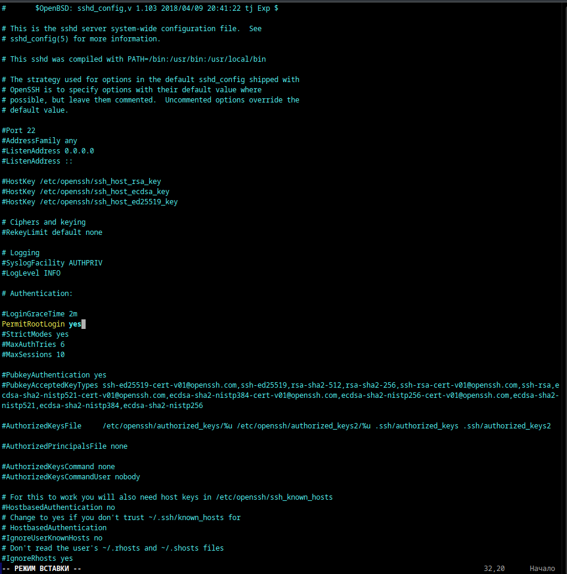
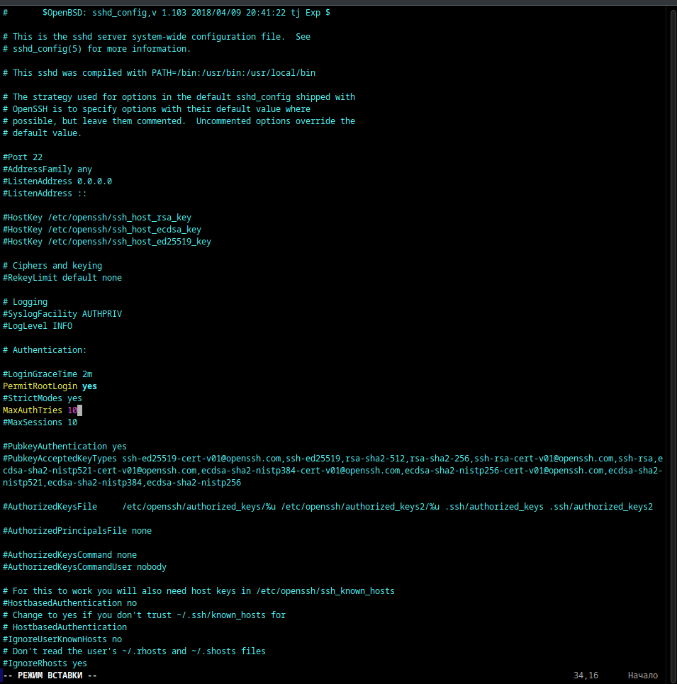
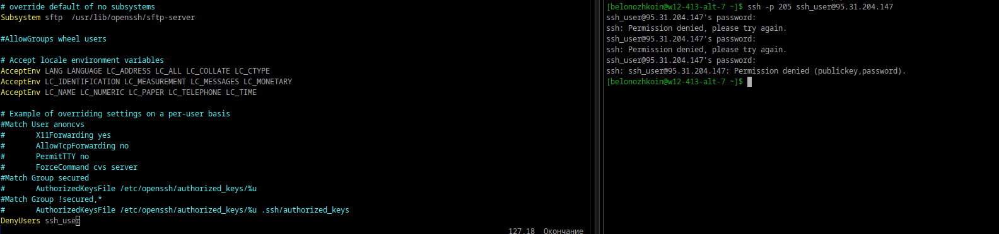

# Илья Белоножко, 1 подгруппа  
**1** порт ssh по умолчанию - 22  
**2** изменить - флаг -p  
**3** sshd отвечает за обработку запросов на подключение к ssh  
**4** файл конфигурации ssh пользователя в alt linux - /etc/.ssh/config, сервера - /etc/openssh/sshd_config  
**5**    
**6** ssh -p 205 root@95.31.204.147  
  
**7**  
  
**8**
`sudo useradd ssh_user`  
`sudo usermod -s /bin/sh`  
`sudo passwd ssh_user`  
  
**9 и 10**  
  
**11** удаленные хосты, к которым подключался пользователь(/home/user/.ssh/known_hosts)
