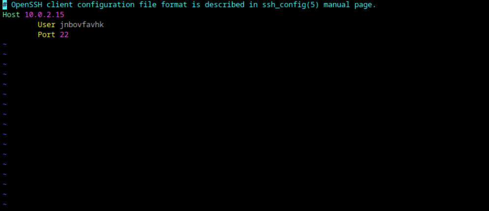
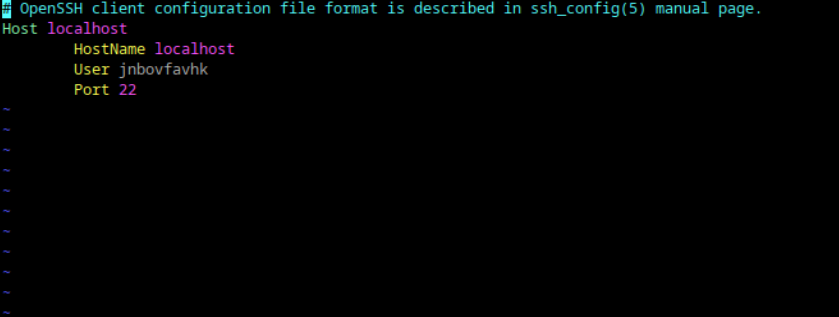

# Илья Белоножко, 1 подгруппа  
## 1 Где хранятся пользвательские и системные настройки подключения?  
пользовательские - в домашней папке в .ssh/config, системные - /etc/openssh/ssh_config
## 2 Что за файл options?  
В контексте ssh нет такого файла, если не имеются в виду конфиги
## 3 Отредактируйте файл options так, чтобы можно было подключаться не вводя имя пользвателя и порт  
  
## 4 Назовите подключение удобным для вас спсобом  
  
## 5 Проверьте работоспособность  
  
