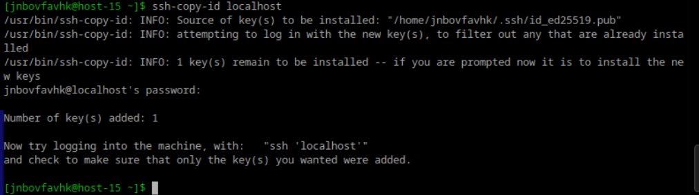
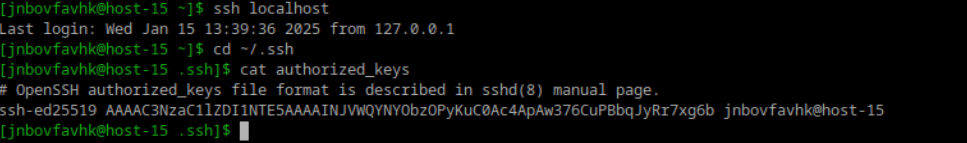
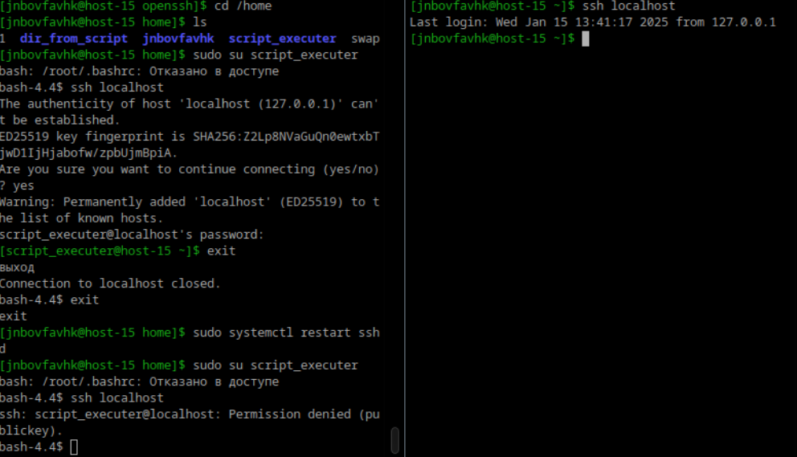

# Илья Белоножко, 1 подгруппа  
## 1 Что такое ssh ключи и зачем они нужны?  
Ssh ключи - пара ключей, публичный и приватный. Используются для более безопасного подглючения к серверу по ssh. 
Как это работает: на удаленном сервере есть файл `~/.ssh/authorized_keys`, содержащий список публичных ключей, которым разрешен доступ к этому серверу.
Когда пользователь пытается подключиться к нему с помощью SSH, сервер отправляет случайное число клиенту для проверки. 
Клиент использует свой приватный ключ для создания цифровой подписи, шифруя это число с помощью приватного ключа.
Затем клиент отправляет эту подпись обратно на сервер.
Сервер использует публичный ключ, хранящийся в authorized_keys, для расшифровки подписи и получения оригинального числа.
Если число такое же, значит клиент владеет соответствующим приватным ключом  

Таким образом, юзеру не придется вводить пароль при заходе на сервер + это безопаснее паролей, так как угадать приватный ключ нельзя
## 2 Как их создать?  
Командой `ssh-keygen`. далее будет предложено выбрать места хранения и пароль(опционально)
## 3 Создайт пару публичный/приватный ключ ed_25519, где они хранятся?  
`ssh-keygen -t ed25519`  
Ключи по умолчанию хранятся в `~/.ssh/id_ed25519.pub` и `~/.ssh/id_ed25519`
## 4 Скопируйте публичный ключ на ваш сервер, в каком файле он будет храниться?  
  
он хранится в `~/.ssh/authorizad_keys`
## 5 Попробуйте подключиться к серверу, у вас запросили пароль?  
  
Пароль не просили:)  
## 6 Запретите подключение с паролем для всех пользователей, оставьте только с помощью ключа.  
Я раскомментировал в файле `/etc/openssh/sshd_config` строки  
`PasswordAuthentication no`  
`ChallengeResponseAuthentication no`  

