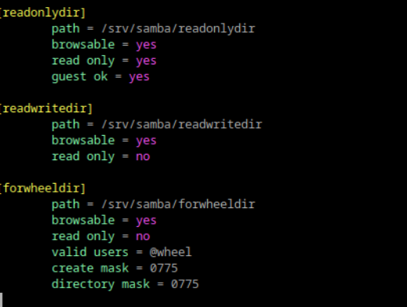
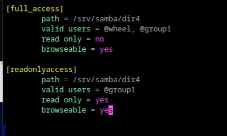

# Илья Белоножко, 1 подгруппа  
## 1 Установите пакет samba  
`sudo apt-get samba`  
готово
## 2 ЧТо такое общая папка, зачем оно может быть нужно?  
Общая папка - папка на сервере, доступная нескольким пользователям для совместного использования. Нужна для каких-нибудь совместных проектов и работ или как централизованное хранилище.  
## 3 Создайте общую папку без пароля с правами только на чтение файлов  
## 4 Создайте общую папку с паролем с правами на чтение и запись  
## 5 Создайте общую папку с доступом для какой-то группы с полными правами  
Нужно доюавить в /etc/samba/smb.conf строки, определяющие доступ к папкам  
  
далее создать папки по указанным в файле путям и назначить им права с помощью chmod. В конце сделать `sudo systemctl restart smb`
## 6 Создайте общую папку в которой у одной группы будет полный доступ, а у другой только доступ на чтение. Третья группа не должна иметь к ней доступа  
  
повторить операции сверху.
