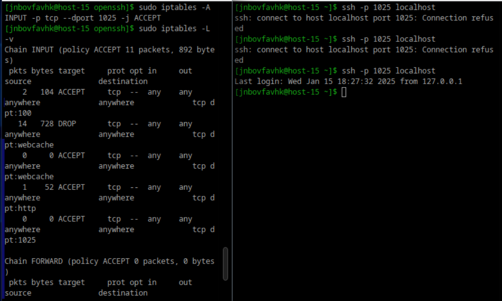

# Илья Белоножко, 1 подгруппа  
## Открываем iptables  
### 1 Установите iptables  
### 2 Проверьте осталась ли возможность подключения по ssh к вашему серверу  
  
### 3 Почему может пропасть такая возможность?  
Потому в iptables может быть правило, запрещающее подключение к порту. 
### 4 Откройте нужный порт на сервере чтобы восстановить подключение  
я открыл порт, написав `sudo iptables -A INPUT -p tcp --dport 1025 -j ACCEPT`
(от желания рута приказываю, пускай в список правил добавится: в цепочку INPUT, которая отвечает за обработку входящих пакетов, по протоколу tcp и порту 1025 проходить разрешается)  
также отредактировал sshd_config, добавив тоду записи `Port 22` и `Port 1025` и перезапустил сервис sshd. Сработало  
  
### 5 Это будет udp или tcp прот?  
Открыл по tcp порту  
### 6 Сохраняются ли записанные вами правила после перезагрузки? Как их сохранить?
по умолчанию нет, но можно записать их в файл /etc/iptables/rules.v4 (v4 указывает на ipv4) таким образом:
`sudo iptables-save > /etc/iptables/rules.v4`
и добавить в `/etc/rc.local` запись `iptables-restore < /etc/iptables/rules.v4`  
Либо пользоваться firewalld
