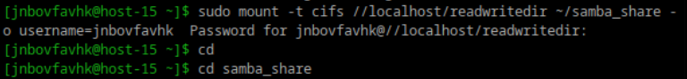
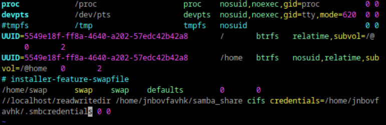

# Илья Белоножко, 1 подгруппа  

## 1 Удалите iptables и установите firewalld  
готово  
## 2 Попробуйте так-же проверить возможность подключения по ssh  
работает  
## 3 Если её нет то откройте порт  
всё есть  
## 4 Выведите список открытых портов с помощью firewall-cmd  
`sudo firewall-cmd --list-ports`  
## 5 Можно ли там добавить порты по названию сервиса?  
можно, наример:  
`sudo firewall-cmd --zone=public --add-service=http`  
## 6 На вашей Локальной виртуальной машине попробуйте подключиться к серверу samba из предыдущих заданий  
  
## 7 Если не получилось то откройте нужные порты  
получилось
## 8 Сделайте так чтобы изменения были постоянными  
Отредактировал fstab  

