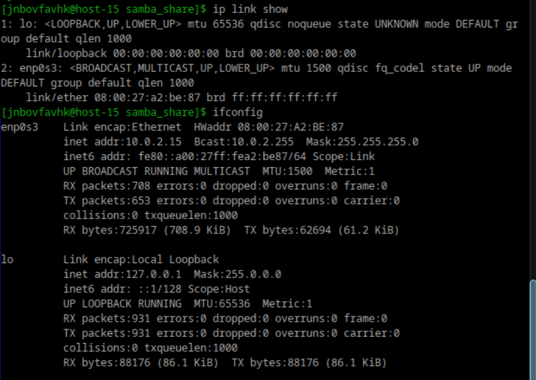

# Илья Белоножко, 1 подгруппа  
## Выведите список интерфейсов, какими способами можно это сделать?  
  
  
## Попробуйте изменить ip адрес  
  
## Попробуте добавить несколько ip адресов на сетевую карту  
  
## Выведите список маршрутов  
  
## Выведите arp таблицу  
  
## Что такое ip адрес?  
уникальный идентификатор каждого устройства в сети
## Для чего нужны маршруты?  
Они оппределяют путь передачи данных от одного устройства к другому через маршрутизаторы  
## Что за протокол arp?  
протокол для опредления mac-адреса по ip-адресу
## Что такое dhcp?  
протокол, который автоматически назначает IP-адреса и другие сетевые параметры устройства в сети. 
## Что такое dns?  
система, которая отвечает за преобразование доменных имен в ip-адреса. Позволяет пользователям использовать удобные для запоминания имена вместо числовых адресов.
## Как называется один из протоколов синхронизации времени?  
ntp
## Что такое широковещательный запрос, зачем он нужен?  
тип сетевого запроса, который отправляется всем устройствам в локальной сети. Он используется для обнаружения устройств или получения информации от всех участников сети. 
## Какой адрес является широковещательным?  
Тот, с которого отправляются широковещательные запросы. Дл ялокальной сети - 255.255.255.255  
## Какие ещё параметры можно задать сетевой карте?  
Маска подсети, DNS-серверы, максимальный размер пакета, который может быть передан по сети,  
шлюз по умолчанию: Указывает маршрутизатор, через который будут отправляться пакеты, не предназначенные для локальной сети.

## Что такое маска подсети? зачем она нужна?  
Определяет, какая часть IP-адреса относится к сети, а какая — к устройству.
